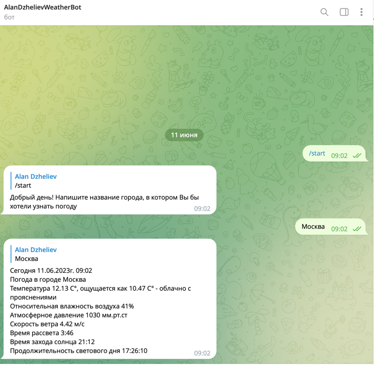

# Погодный Telegram-бот

Каждый разработчик в своей жизни должен посадить дерево, построить дом и написать телеграм-бот.
И я, конечно же, не исключение.
___
### Функционал
Бот принимает на вход наименование города и выводит данные по погоде в этом городе в настоящее время

### Использованные библиотеки
См. requirements.txt

### Безопасность
Токен бота не скрыт, так как это просто пример проекта